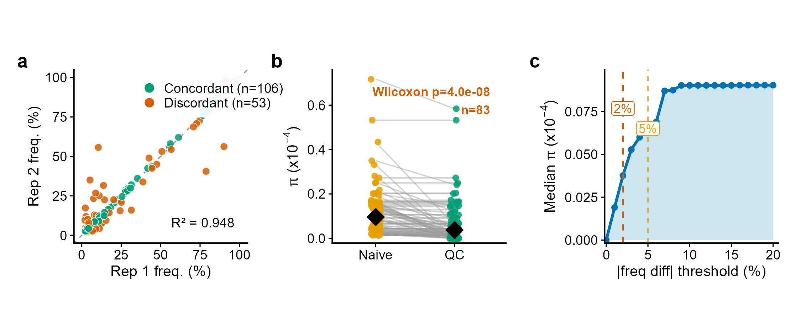
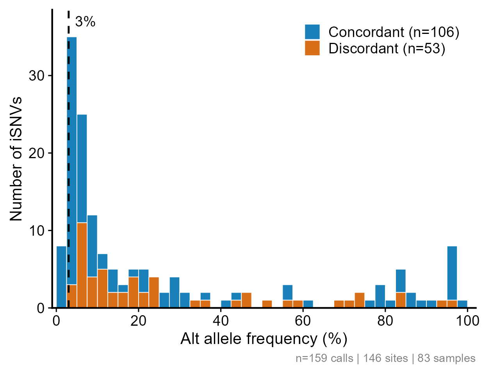
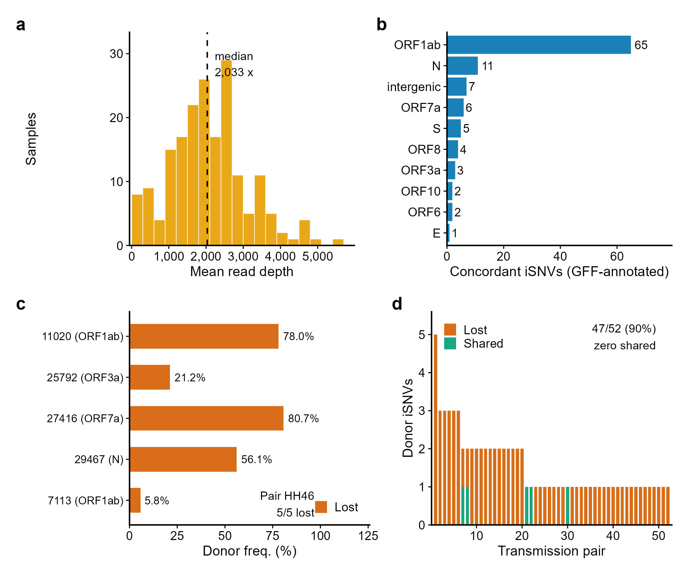
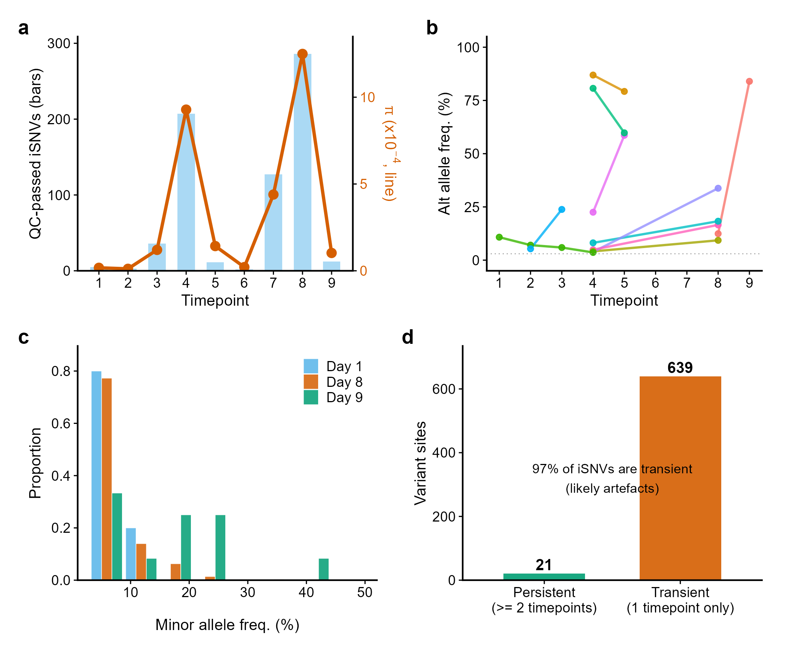
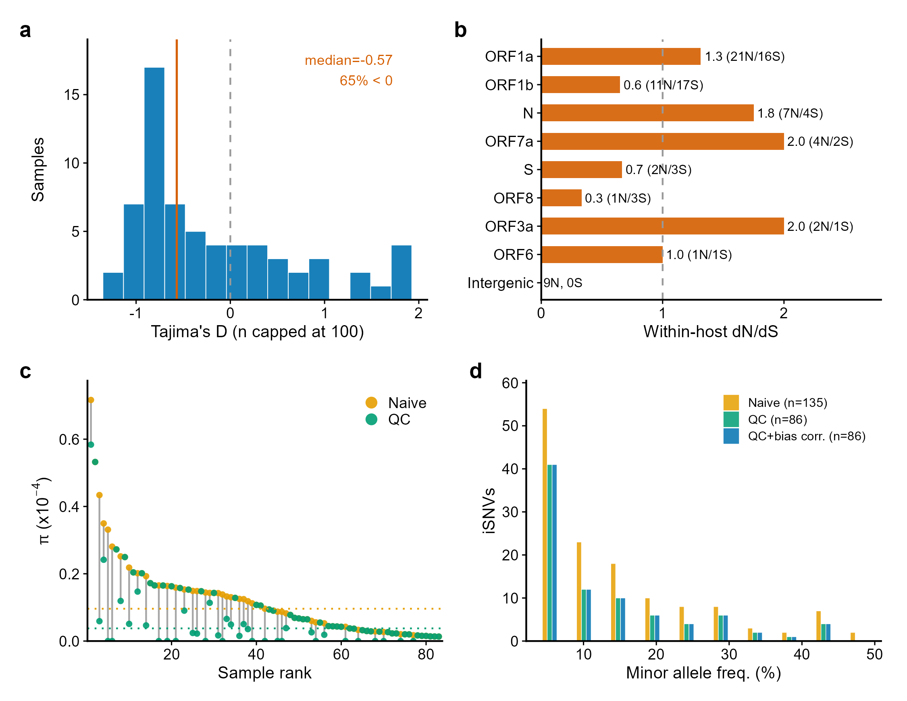
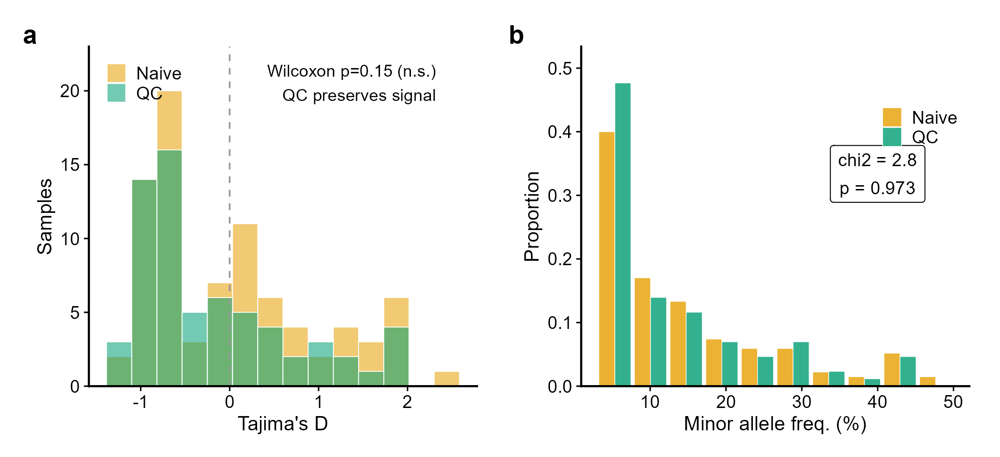

<div align="center">

# WithinHostExperiment

*Bioconductor Infrastructure for Within-Host Pathogen Variant QC,
Diversity, and Transmission Bottleneck Workflows*

[](https://opensource.org/licenses/Artistic-2.0)
[](https://bioconductor.org/)

</div>

---

## Why does this package exist?

Researchers studying within-host pathogen evolution run into four
practical problems:

1. **Unreplicated iSNV calls include noise** -- in the duplicate
   sequencing of Bendall *et al.* (2023), 53 of
   159 calls (33%) differ by more
   than 2 percentage points between replicates (Figure 1).
2. **Fragmented tooling** -- importing from iVar, annotating genes,
   filtering, computing diversity and exporting for bottleneck
   estimation are often handled by separate scripts (Figure 3).
3. **Longitudinal data need their own checks** -- following variant
   frequencies across sampling days needs tracking and consistency flags
   that a single-sample workflow has no use for (Figure 4).
4. **Hard filtering loses provenance** -- deleting variants that fail
   a threshold prevents re-analysis under other criteria. Flagging
   instead keeps every call, while downstream summaries use only those
   that pass (Figures 1c, 6).

`WithinHostExperiment` brings these steps into one
`RangedSummarizedExperiment`-based container, from import through
replicate-aware QC, diversity and longitudinal summaries to export for
bottleneck estimation.

---

## Data sources

All figures use real, publicly available data:

| Source | Data | Role |
|---------|-----------|------|
| **Bendall *et al.* (2023)** *Nat. Commun.* 14:272 | 159 iSNVs, 83 samples, duplicate sequencing, 132 transmission pairs | QC, diversity, transmission, population genetics (Figs 1--3, 5--6) |
| **Farjo *et al.* (2024)** *J. Virol.* 98:e01618-23 | Participant 432870: 9 daily saliva samples; the 6 that the study analysed (mean coverage of at least 1,000x; days 1, 2, 3, 4, 7, 8) are used | Longitudinal within-host evolution (Fig 4) |
| **NCBI RefSeq** NC_045512.2 | SARS-CoV-2 gene annotation (GFF3) and reference sequence (FASTA) | `annotateFromGFF()` and the codon translation behind `dndsWithinHost()` (Figs 3b, 5b) |

All figures were generated with R version 4.6.1 by
`inst/scripts/generate_readme_figures.R`, which also writes every number
quoted below to `readme_figure_values.csv`; the captions are filled from
that file by `inst/scripts/fill_readme.R`, which refuses to write a caption
for a figure that run did not produce. No data were simulated. Frequencies
are those of replicate 1 throughout, except in Figure 2, which bins the mean
of the two replicates.

---

## Problem 1: Unreplicated calls include noise

<div align="center">

</div>

> **Figure 1 | Replicate-aware QC and post-hoc threshold exploration.**
> **(a)** Replicate frequencies for 159 iSNV calls:
> concordant (|frequency difference| <= 2 percentage points,
> *n* = 106) and discordant
> (*n* = 53); R^2 = 0.948. That figure is carried by the
> spread across the whole range: among the calls below 10% mean frequency,
> where QC does its work, R^2 is 0.153, and the median difference
> between replicates is 1.1 percentage points.
> **(b)** Per-sample nucleotide diversity before (naive) and after
> replicate QC; black diamonds mark the medians
> (0.096 and 0.038 x 10^-4). QC only removes
> calls, so pi cannot rise. It left pi untouched in most samples and lowered it
> in 38 of 83, by a median of 88% among those;
> in 18 samples no call survived and pi fell to zero.
> **(c)** Median pi as the concordance threshold varies from 0 to 20
> percentage points of replicate difference, recomputed from the replicate
> frequencies already in the object rather than by re-importing and
> re-filtering the data; the dashed lines mark 2 and 5 percentage points.

<div align="center">

</div>

> **Figure 2 | Where discordant calls fall.**
> Mean replicate frequencies of the 159 calls, which fall at
> 146 distinct variants (position and substitution).
> Discordance is not confined to the low-frequency band where sequencing and
> amplification errors are hardest to tell apart from genuine minority
> variants: 18 of the 53 discordant calls sit below 10%
> (34%), against 62 of the 106 concordant ones
> (58%), so replicates disagree more often at intermediate
> frequencies than at the bottom of the range. Part of that is the rule
> itself: a fixed tolerance in percentage points removes more calls where
> the sampling spread of the difference is wider, as Figure 6b sets out.

---

## Problem 2: One package, complete workflow

<div align="center">

</div>

> **Figure 3 | From raw data to annotated transmission pairs.**
> **(a)** Mean read depth, averaged over the two replicates, for all
> 188 sequenced samples (median 2,033x); the 83 samples that carry at
> least one iSNV call, and that every other panel uses, are a subset of them.
> **(b)** Concordant iSNV calls by gene, annotated with
> `annotateFromGFF()` from the NCBI GFF3.
> **(c)** Pair HH17_K, the pair with the most concordant donor iSNVs
> among those whose recipient carries calls of its own:
> 3 of 3 donor iSNVs have no call in the recipient,
> which carries 2 of its own.
> **(d)** Of the 52 pairs whose donor carried at least one
> concordant iSNV (132 pairs in the metadata),
> 47 (90%) share none with the recipient.
> Two limits matter for reading this panel. Recipient calls are limited to
> frequencies of 2--98%, so a donor variant that became fixed in the recipient
> also counts as not shared; and in 26 of these pairs the recipient
> carries no iSNV call at all, so absence of data is recorded here as absence
> of sharing. The panel describes detection and is not a bottleneck estimate
> (Bendall *et al.* 2023 report those).

---

## Problem 3: Longitudinal tracking needs infrastructure

<div align="center">

</div>

> **Figure 4 | Within-host dynamics across sampling days.**
> Daily saliva samples from one SARS-CoV-2 participant (Farjo *et al.*
> 2024), limited to the 6 samples the study analysed (days
> 1, 2, 3, 4, 7, 8); a call needs at least 1,000 reads and a frequency
> between 3% and 97%. The iVar tables also list insertions and deletions;
> 909 such rows are dropped and the 1,252 substitution rows kept, so every
> count below is of iSNVs.
> **(a)** Richness (bars) and pi (line): QC-passed iSNVs peak at
> 141 on day 8, and pi peaks on day
> 8.
> **(b)** Frequency trajectories of the 10 variants with the
> widest frequency range, tracked with `trackFrequency()`; the dotted
> line marks the 3% threshold.
> **(c)** Folded spectra from `buildSFS()` on the first, peak and last
> sampled days, which here are days 1, 8; two of them coincide when the
> peak falls on the first or last day sampled.
> **(d)** `flagTemporalInconsistency()`: 288 of 294 variant
> sites (98%) are detected on a single day. A site can also be
> missed on a day when its depth is below 1,000 reads, or when its frequency
> leaves the 3--97% window, so a variant that goes to fixation is counted the
> same way; transient sites are flagged for review rather than treated as
> errors.

---

## Evolutionary summaries from the same flagged data

<div align="center">

</div>

> **Figure 5 | Population-genetic summaries of the flagged data.**
> **(a)** Tajima's D for the 65 samples with at least one
> concordant iSNV and a finite D, using read depth capped at 100 as the sample size:
> median -0.57, 65% below zero. These are weak summaries and are
> shown as such: 41 of the 65 samples (63%) carry a single
> concordant call, where D is a monotone function of that one frequency rather
> than a description of a spectrum, and only 10 carry three or more. Calls
> below the 2% frequency threshold are absent, and negative D is expected both
> under purifying selection and after population growth, so these values
> describe the spectra rather than test either.
> **(b)** Nei-Gojobori ratio of nonsynonymous to synonymous iSNVs per
> site, pooling concordant calls across samples
> (50 nonsynonymous, 49 synonymous; pooled ratio 0.29).
> A further 7 concordant calls lie outside the annotated
> coding sequences, or carry no codon annotation, and enter neither count.
> These are counts of polymorphism within hosts rather than of substitutions
> between them, so the ratio is a pN/pS, and the Jukes-Cantor correction it
> carries barely moves proportions this small.
> The panel shows the 8 genes with at least two counted calls and a
> defined ratio, leaving out 1; those ratios rest on a handful of calls and
> are given with their counts. None of them is evidence of selection on any
> gene.
> **(c)** Per-sample pi ranked by the naive estimate; segments show the
> reduction from QC.
> **(d)** Naive, QC and bias-corrected spectra as `WithinHostSFS`
> objects from `buildSFS()` and `correctSFSBias()` (binomial correction).
> The correction reweights bins by the chance of observing a variant at that
> frequency given the depth; at this depth every bin is far above the
> detection limit, so it changes 0 bins and the corrected series lies
> under the QC one.

---

## Problem 4: QC should remove noise, not signal

<div align="center">

</div>

> **Figure 6 | What replicate QC changes.**
> **(a)** Tajima's D before and after QC in the 65 samples with a
> finite value in both: median -0.35 before QC and -0.57 after. QC
> removed no call in most of them, so it changed D in 20 samples, and among
> those the median change is -0.23 (95% CI -0.42 to 0.09, distribution-free
> from binomial order statistics). Taken over all 65 the median change is
> 0.00 with an interval of 0.00 to 0.00: the unchanged samples
> outnumber the rest, so that interval collapses onto the median and carries no
> information about the size of the change. A further 18 samples leave the
> comparison altogether because QC removed every call and D has no value after
> it -- the samples QC affected most.
> **(b)** Frequency spectra of the calls QC kept and the calls it removed
> (86 and 49 of them fall inside the binned
> frequency range), compared with `compareSFS()`:
> chi-squared = 10.3, df = 9, asymptotic *p* = 0.327 and
> Monte Carlo *p* from 10^5 tables = 0.332; the smallest expected count is
> 0.7. Two things keep this descriptive: calls pooled across samples
> are not independent draws, and the concordance rule is a fixed 2-percentage-point
> tolerance on a difference whose sampling spread grows with frequency, so the
> two groups would differ in shape to some degree even if every call were
> genuine.

---

## Installation

```r
# After Bioconductor acceptance:
if (!require("BiocManager", quietly = TRUE))
    install.packages("BiocManager")
BiocManager::install("WithinHostExperiment")

# Development version from GitHub:
BiocManager::install("CuiweiG/WithinHostExperiment")
```

## Quick start

```r
library(WithinHostExperiment)

# 1. Import donor and recipient VCFs
vcf_d <- system.file("extdata", "test_donor.vcf",
    package = "WithinHostExperiment")
vcf_r <- system.file("extdata", "test_recipient.vcf",
    package = "WithinHostExperiment")
whe <- readWithinHost(c(vcf_d, vcf_r),
    colData = S4Vectors::DataFrame(
        sample_id = c("donor", "recipient"),
        role      = c("donor", "recipient"),
        pair_id   = c("pair_1", "pair_1")),
    caller = "ivar")

# 2. QC -- flag, don't delete
whe <- flagISNV(whe, ISNVFilter(minDepth = 200L, minFreq = 0.03))

# 3. Diversity (finite-sample corrected pi)
div <- calcDiversity(passedISNV(whe), genomeLength = 29903L)

# 4. Transmission bottleneck
nb <- quickBottleneck(whe, pairId = "pair_1")
```

---

## Key design principles

1. **Flag, don't delete.** QC marks variants in `qcPass` rather than
   removing rows, preserving all data for re-analysis under different
   thresholds.
2. **Replicate-aware.** Technical replicate concordance is part of
   the QC step rather than a separate script.
3. **Interoperable, don't reinvent.** Standardised export to
   ViralBottleneck (Zheng *et al.* 2025) and VRanges-based
   Bioconductor workflows.
4. **Bioconductor-native.** Built on `RangedSummarizedExperiment`;
   subsetting, combining, and accessors follow Bioconductor
   conventions.

## Relationship to existing tools

| Tool | Role | Relationship |
|------|------|-------------|
| iVar, LoFreq, Freebayes | Variant calling | Upstream -- we import their output |
| deepSNV | Low-frequency variant detection | Upstream -- complementary |
| ViralBottleneck | Bottleneck estimation (6 methods) | Downstream -- we export to it; also self-contained via `exactBottleneck()` |
| QSutils | Quasispecies diversity | Parallel -- different granularity (haplotype vs iSNV) |
| CliqueSNV, ShoRAH | Haplotype phasing | Complementary -- their output can feed into WHE |

## Reproducibility

All README figures are generated from public data by one script, and the
captions are then filled from the values it records:

```r
# Clone the repository, then from the package root directory:
source("inst/scripts/generate_readme_figures.R")
source("inst/scripts/fill_readme.R")
```

Data files in `inst/scripts/real_data/` (GitHub only, not in installed package):

| File | Source | Description |
|------|--------|-------------|
| `all_variants_filtered.tsv` | Bendall *et al.* 2023 | 159 iSNV calls, 83 samples, both replicates |
| `AvgCoverage.all` | Bendall *et al.* 2023 | Per-replicate mean amplicon depth |
| `Transmission_pairs.csv` | Bendall *et al.* 2023 | Household transmission pair metadata |
| `farjo_longitudinal/` | Farjo *et al.* 2024 | Daily saliva iVar TSVs for participant 432870, with `samples_432870.csv` (dates, coverage and study inclusion, built by `inst/scripts/prepare_farjo_metadata.R` from github.com/BROOKELAB/SARS-CoV-2-within-host-evolution) |
| `sars2_NC045512.gff3` | NCBI RefSeq | SARS-CoV-2 gene annotation (NC_045512.2) |
| `sars2_NC045512.fasta` | NCBI RefSeq | Reference sequence (NC_045512.2), read by `annotateCodonChange()` for Figure 5b |
| `MHM*_rep*.tsv`, `all_variants_filtered_unmerged.tsv` | Bendall *et al.* 2023 | Per-sample iVar tables and the pre-merge call table, kept as provenance for the merged file above; the figure script reads neither |
| `farjo_longitudinal/user_432870.csv` | Farjo *et al.* 2024 | The study's own per-SNP summary for this participant, kept for comparison; not read by the figure script |

## Key references

- Farjo M *et al.* (2024) Within-host evolutionary dynamics and
  tissue compartmentalization during acute SARS-CoV-2 infection.
  *J. Virol.* 98:e01618-23.
- Roder AE *et al.* (2023) Optimized quantification of intra-host
  viral diversity in SARS-CoV-2 and influenza virus sequence data.
  *mBio* 14:e01046-23.
- Bendall EE *et al.* (2023) Rapid transmission and tight bottlenecks
  constrain the evolution of highly transmissible SARS-CoV-2 variants.
  *Nat. Commun.* 14:272.
- Sobel Leonard A *et al.* (2017) Transmission bottleneck size
  estimation from pathogen deep-sequencing data. *J. Virol.*
  91:e00171-17.
- Mostefai F *et al.* (2024) Refining SARS-CoV-2 intra-host variation
  by leveraging large-scale sequencing data. *NAR Genom. Bioinform.*
  6:lqae145.
- Zheng B, Johnson PCD, Hughes J (2025) ViralBottleneck: an R package for
  estimating viral transmission bottlenecks. *Virus Evol.*
  11:veaf071.
- Tajima F (1989) Statistical method for testing the neutral mutation
  hypothesis by DNA polymorphism. *Genetics* 123:585-595.
- Fu YX (1997) Statistical tests of neutrality of mutations against
  population growth. *Genetics* 147:915-925.
- Nei M, Gojobori T (1986) Simple methods for estimating the numbers
  of synonymous and nonsynonymous substitutions. *Mol. Biol. Evol.*
  3:418-426.

## Documentation

- [Vignette: Introduction to WithinHostExperiment](vignettes/WithinHostExperiment.Rmd)
- [GitHub repository](https://github.com/CuiweiG/WithinHostExperiment)

The continuous-integration configuration lives on the `ci` branch; the default
branch holds the package source only.
